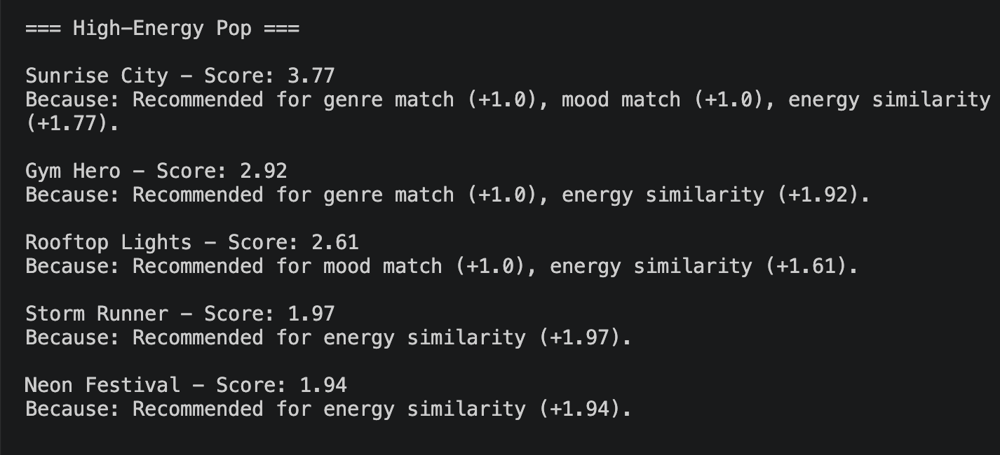
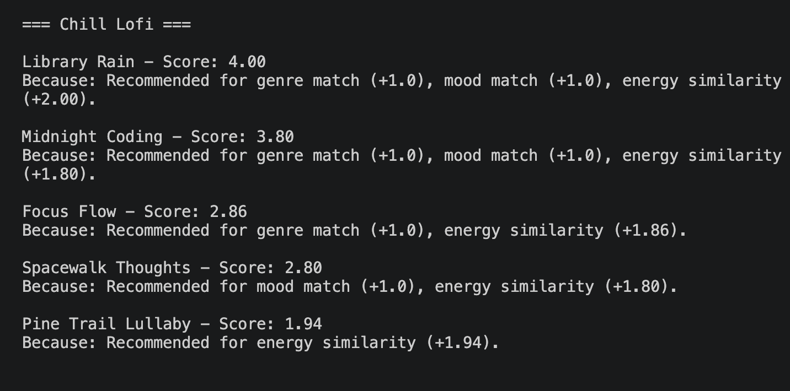
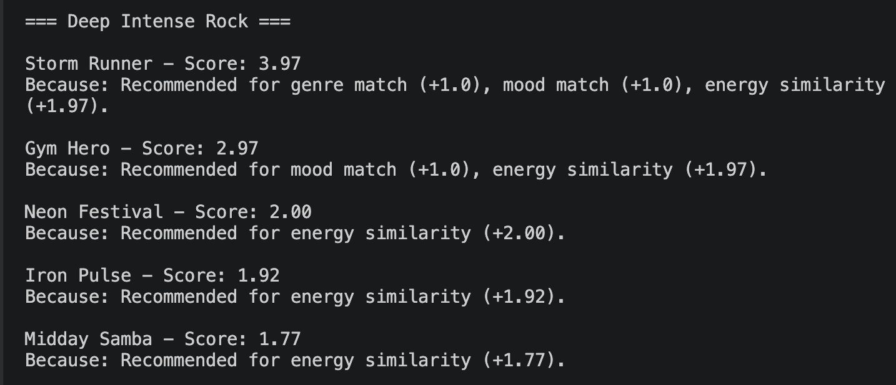
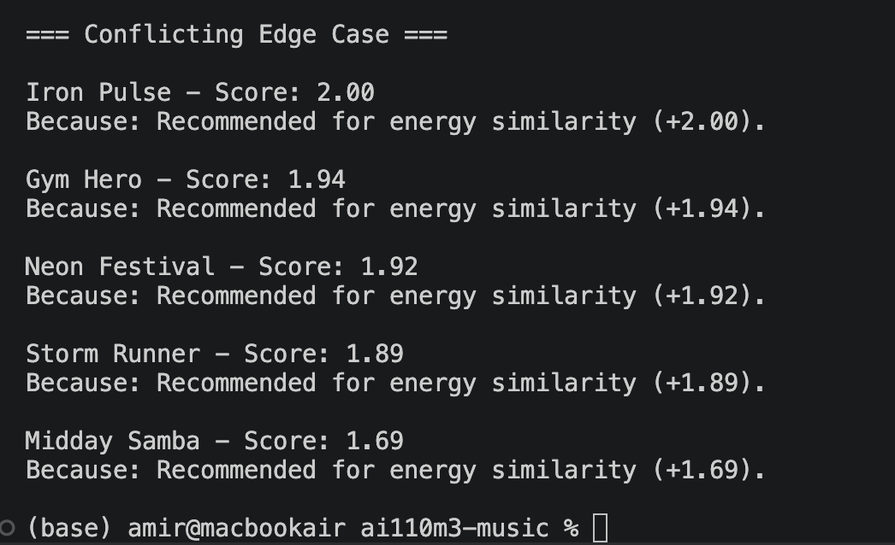

# 🎵 Music Recommender Simulation

## Evaluation Screenshots

These screenshots show the terminal output from the profile stress test. They reflect the temporary experiment where energy was weighted more strongly than genre.

### High-Energy Pop



### Chill Lofi



### Deep Intense Rock



### Conflicting Edge Case



## Project Summary


---

## How The System Works

This recommender follows a simple input -> score -> rank pipeline.

### Features Used

Each song includes metadata (`title`, `artist`, `genre`, `mood`) and numeric audio features (`energy`, `tempo_bpm`, `valence`, `danceability`, `acousticness`).

The active scoring recipe uses:

1. `genre` (categorical match)
2. `mood` (categorical match)
3. `energy` (numeric closeness to user target)

### User Profile

The user profile dictionary stores target preferences, for example:

1. `favorite_genre`
2. `favorite_mood`
3. `target_energy`

These are mapped into the scoring inputs (`genre`, `mood`, `energy`) when recommendations are generated.

### Finalized Algorithm Recipe

1. Load songs from `data/songs.csv`.
2. For each song, initialize score to 0.
3. Add `+2.0` if song genre matches user favorite genre.
4. Add `+1.0` if song mood matches user favorite mood.
5. Add energy similarity points in `[0, 1]` based on closeness to user target energy.
6. Store `(song, score, explanation)`.
7. After all songs are scored, sort by score descending.
8. Return top `k` songs.

Scoring equation:

Final Score = Genre Match Points + Mood Match Points + Energy Similarity Points

Energy similarity is computed with normalized distance:

Energy Similarity Points = 1 - |e_song - e_target| / energy range in dataset

### Potential Bias Note

This system can over-prioritize whichever feature has the biggest weight. In the baseline recipe, genre can dominate the score, which may hide songs that match the user's mood and energy but not the genre. In the temporary experiment run, energy became stronger, so intense songs could rise even when the genre or mood was only a partial match. In both cases, the model still ignores other useful signals like tempo, danceability, and artist diversity.

---

## Getting Started

### Setup

1. Create a virtual environment (optional but recommended):

   ```bash
   python -m venv .venv
   source .venv/bin/activate      # Mac or Linux
   .venv\Scripts\activate         # Windows

2. Install dependencies

```bash
pip install -r requirements.txt
```

3. Run the app:

```bash
python -m src.main
```

### Running Tests

Run the starter tests with:

```bash
pytest
```

You can add more tests in `tests/test_recommender.py`.

---

## Experiments You Tried

I ran a sensitivity experiment where energy mattered more than genre. That changed the ranking order for mixed profiles and made high-energy songs rise faster even when the genre did not match perfectly.

The biggest difference showed up for the conflicting profile: even though the genre and mood were unusual, the recommender still pushed energetic songs near the top. That told me the score is reacting strongly to energy and can be steered by one feature when the weights are changed.

---

## Limitations and Risks

The recommender only sees a tiny catalog, so it can repeat the same songs for different users. It does not understand lyrics, artist relationships, or whether two moods are related in a subtle way. Because the experiment gave energy extra weight, it can also over-favor songs that feel intense even when the user's genre or mood is a better clue.

You will go deeper on this in the model card.

---

## Reflection

Read and complete `model_card.md`:

[**Model Card**](model_card.md)

Write 1 to 2 paragraphs here about what you learned:

- about how recommenders turn data into predictions
- about where bias or unfairness could show up in systems like this

See [reflection.md](reflection.md) for the pair-by-pair comparison notes.

See [reflection.md](reflection.md) for the profile-by-profile comparison notes.


---

## 7. `model_card_template.md`

Combines reflection and model card framing from the Module 3 guidance. :contentReference[oaicite:2]{index=2}  

```markdown
# 🎧 Model Card - Music Recommender Simulation

## 1. Model Name

Give your recommender a name, for example:

> VibeFinder 1.0

---

## 2. Intended Use

- What is this system trying to do
- Who is it for

Example:

> This model suggests 3 to 5 songs from a small catalog based on a user's preferred genre, mood, and energy level. It is for classroom exploration only, not for real users.

---

## 3. How It Works (Short Explanation)

Describe your scoring logic in plain language.

- What features of each song does it consider
- What information about the user does it use
- How does it turn those into a number

Try to avoid code in this section, treat it like an explanation to a non programmer.

---

## 4. Data

Describe your dataset.

- How many songs are in `data/songs.csv`
- Did you add or remove any songs
- What kinds of genres or moods are represented
- Whose taste does this data mostly reflect

---

## 5. Strengths

Where does your recommender work well

You can think about:
- Situations where the top results "felt right"
- Particular user profiles it served well
- Simplicity or transparency benefits

---

## 6. Limitations and Bias

Where does your recommender struggle

Some prompts:
- Does it ignore some genres or moods
- Does it treat all users as if they have the same taste shape
- Is it biased toward high energy or one genre by default
- How could this be unfair if used in a real product

---

## 7. Evaluation

How did you check your system

Examples:
- You tried multiple user profiles and wrote down whether the results matched your expectations
- You compared your simulation to what a real app like Spotify or YouTube tends to recommend
- You wrote tests for your scoring logic

You do not need a numeric metric, but if you used one, explain what it measures.

---

## 8. Future Work

If you had more time, how would you improve this recommender

Examples:

- Add support for multiple users and "group vibe" recommendations
- Balance diversity of songs instead of always picking the closest match
- Use more features, like tempo ranges or lyric themes

---

## 9. Personal Reflection

A few sentences about what you learned:

- What surprised you about how your system behaved
- How did building this change how you think about real music recommenders
- Where do you think human judgment still matters, even if the model seems "smart"

